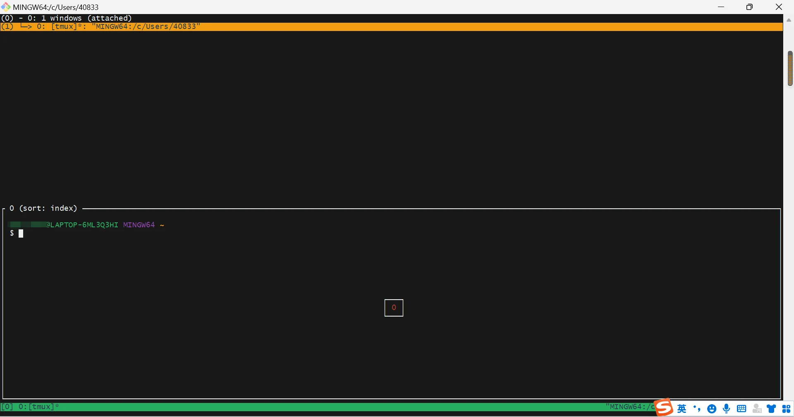

# deploy

## 1. Mac

### shell
- zsh
- .zshrc
### 操作习惯
- set default Fn: 系统设置 > 键盘 > 使用F1、F2等键为标准功能键
- set Caps Lock 切换中/英文: 系统设置 > 键盘 > Input Sources > 勾上 Use the 中/英 key to switch to and from ABC

### Terminal SSH 一段时间不操作之后卡死
sudo vim /etc/ssh/ssh_config

增加或修改

    ServerAliveInterval 50 #每隔50秒就向服务器发送一个请求
    ServerAliveCountMax 3  #允许超时的次数，一般都会响应

### How to Change the Screenshot File Format to JPG/HEIC on Mac
Terminal 输入以下命令

    defaults write com.apple.screencapture type jpg;killall SystemUIServer
    defaults write com.apple.screencapture type heic;killall SystemUIServer

### Homebrew
Install homebrew

    /bin/zsh -c "$(curl -fsSL https://gitee.com/cunkai/HomebrewCN/raw/master/Homebrew.sh)"

Homebrew 源镜像配置在.zshrc 中

Install Basic Tool

    brew install webp
    cwebp -q 80 x.jpg -o x.webp
    dwebp image.webp -o image.png

    brew install tmux
    brew install --cask maccy # 粘贴版工具，避免复制重置浪费时间寻找
    
Install Nginx/php/mysql

    brew install nginx
    brew install php@7.4
    echo 'export PATH="/usr/local/opt/php@7.4/bin:$PATH"' >> ~/.zshrc
    echo 'export PATH="/usr/local/opt/php@7.4/sbin:$PATH"' >> ~/.zshrc
    brew services restart php@7.4
    brew install mysql

[安装YAF](https://pecl.php.net/package/yaf)

    $ curl http://pecl.php.net/get/yaf-3.3.4.tgz > yaf.tgz
    $ tar -xzvf yaf.tgz
    $ rm yaf.tgz
    $ cd yaf*
    $ /usr/local/Cellar/php@7.4/*/bin/phpize
    Configuring for:
    PHP Api Version:         20170718
    Zend Module Api No:      20170718
    Zend Extension Api No:   320170718
    $ setopt no_nomatch  # 解决执行下行命令 zsh 下no matches found问题
    $ ./configure --with-php-config=/usr/local/Cellar/php@7.4/*/bin/php-config
    $ make && make install

### Mysql

    brew services start mysql
    # The default username for mysql is root and there is no password.
    
    # mysql_secure_installation
    
    Set root password? [Y/n] Y #123456
    Remove anonymous users? [Y/n] Y
    Disallow root login remotely? [Y/n] Y
    Remove test database and access to it? [Y/n] Y
    Reload privilege tables now? [Y/n] Y
    
    mysql -u root -p
    
    > create user 'dbuser'@'localhost' identified by 'dbpassword';
    > grant all privileges on *.* to dbuser@localhost;
    > flush privileges;
    
    > show global variables like 'port'; # 显示mysql 端口号 3306
    
    brew services restart mysql
    
the server requested authentication method unknown to the client [sha256_password]

    # mysql8.0默认使用caching_sha2_password，但是之前版本都是使用mysql_native_password
    > select user,host,plugin from mysql.user;
    > ALTER USER 'root'@'localhost' IDENTIFIED WITH mysql_native_password BY '123456'
    > ALTER USER 'dbuser'@'localhost' IDENTIFIED WITH mysql_native_password BY 'dbpassword'

Your password does not satisfy the current policy requirements

    # 查看 mysql 初始的密码策略
    > SHOW VARIABLES LIKE 'validate_password%';
    > set global validate_password.policy=LOW;
    > set global validate_password.length=6;

### PHP

    vim /usr/local/etc/php/7.4/php-fpm.d/www.conf
    vim /usr/local/etc/php/7.4/php.ini
    brew services start php@7.4

YAF配置

    ...
    extension=yaf.so
    ...

### Nginx

    /usr/local/etc/nginx/nginx.conf

    sudo nginx -t # Test that you your configuration file syntax is ok
    sudo brew services restart nginx

设置 https

    % cd /usr/local/etc/nginx/
    % mkdir cert_key
    % cd cert_key
    % openssl genrsa -des3 -out mk.key 2048
    Enter pass phrase for mk.key:5xF3u7Rp
    Verifying - Enter pass phrase for mk.key:5xF3u7Rp
    
    % openssl req -new -sha256 -key mk.key -out mk.csr -subj "/C=CN/ST=Shenzhen/L=Guangdong/O=Markbuild/CN=localhost"
    Enter pass phrase for mk.key:5xF3u7Rp
    
    % openssl x509 -req -sha256 -days 365 -in mk.csr -signkey mk.key -out mk.crt
    Signature ok
    subject=/C=CN/ST=Shenzhen/L=Guangdong/O=Markbuild/CN=localhost
    Getting Private key
    Enter pass phrase for mk.key: 5xF3u7Rp
    
    % cp mk.key mk.key.org
    % openssl rsa -in mk.key.org -out mk.key
    Enter pass phrase for mk.key.org:
    writing RSA key

ssl nginx.conf

    # HTTPS server

    server {
        listen       443 ssl;
        server_name  localhost;
        root   /Users/mk/code/;
        index index.php index.html;

        location / {
            try_files $uri $uri/ /index.php?$args;
        }

        location ~ \.php$ {
            try_files $uri = 404;
            fastcgi_pass   127.0.0.1:9000;
            fastcgi_param  SCRIPT_FILENAME  $document_root$fastcgi_script_name;
            include        fastcgi_params;
        }

        ssl_certificate      cert_key/mk.crt;
        ssl_certificate_key  cert_key/mk.key;

    }

### 卸载程序
删除deno

    rm `which deno`

## 2. Windows

### gitbash/msys2 + tmux
使用 tmux: 主要是为了解决 windows下 gitbash/msys2 不支持多 tab，而产生切换麻烦的多窗口

- https://ftp.acc.umu.se/mirror/cygwin/x86_64/release/tmux/
- https://ftp.acc.umu.se/mirror/cygwin/x86_64/release/libevent/

[直接下载](https://github.com/markbuild/build_dev_env/blob/main/resource/tmuxBinaryFromMsys2.zip)

- [选项1] 拷贝 tmux.exe 和 以 msys-event 开头的几个文件到 C:\Program Files\Git\user\bin
- [选项2] 拷贝 tmux.exe 和 以 msys-event 开头的几个文件到  C:\msys64\user\bin

Theme: flat-ui

截图快捷键: <kbd>⊞</kbd> + <kbd>Shift</kbd> + <kbd>S</kbd>

### shell
- bash
- .bashrc

## 3. iPhone
iSH
[口袋键盘](https://markbuild.com/zh/tag/口袋键盘/)

### shell
- ash
- ~/.profile

## 4. Common
### WorkDir

    ~/
    |__ code (github + gitee 双origin)
    |   |__ git
    |
    |__ Desktop
    |__ Downloads
    |__ icloud (ln -s "/Users/mk/Library/Mobile Documents/com~apple~CloudDocs" ~/icloud)
    |__ Software
    |   |__ chrome/  这个是存放cors
    |   |__ mscp
    |
    |__ timeline (backup to USB Flash Drives)

作为快10年的vim用户，我不会接受 vscode+vim, 但我会使用一段时间，并把它好的功能借鉴转变到vimrc中，一个工具不可能各方面都胜过另一个工具，我只需以最少的扩展代码满足80%使用频率的20%对象。之前做Flashvim 面对快捷键冲突问题总想着去解决，其实没必要，那种频率比较少，可以放弃满足而减少代码 - [上午7:57 · 2023年6月7日(https://twitter.com/markbuild2022/status/1666232861253595136)

